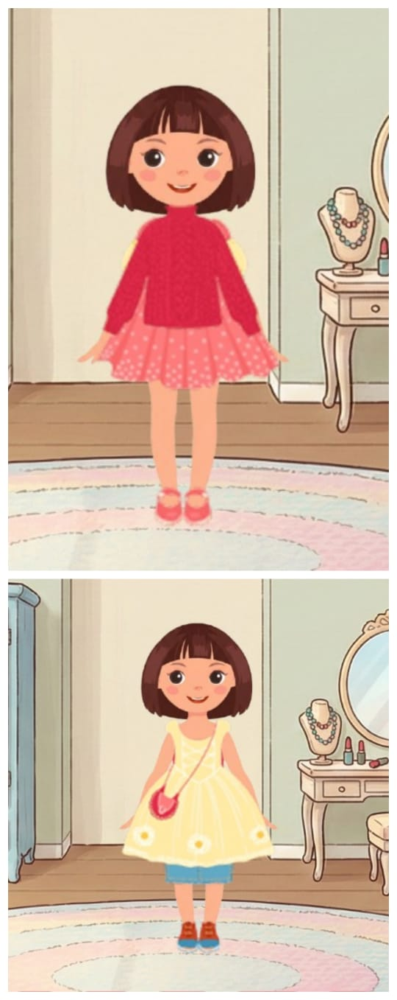
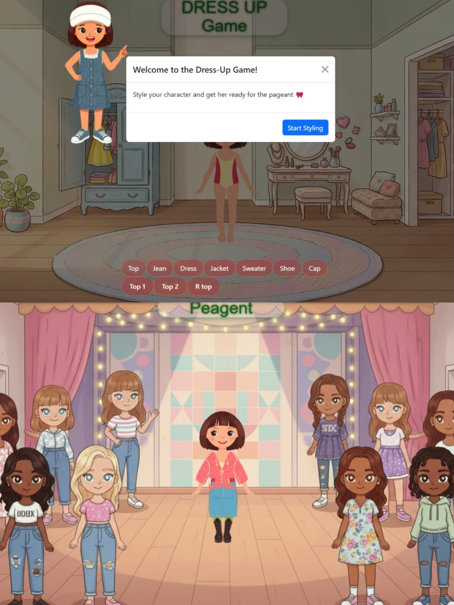

# 🎀 Dress-Up Game

A fun and interactive dress-up game built with React where you can style a character for a pageant! Mix and match various clothing items to create the perfect fashion look.

## 🎮 Live Demo
[Add your live demo link here]

## ✨ Features
- **Multiple Clothing Categories**: Choose from tops, dresses, jackets, jeans, shoes, sweaters, and caps
- **Real-time Preview**: See your character update instantly as you select different clothing items
- **Layer System**: Clothing items are properly layered with correct z-index ordering
- **Two Modes**: 
  - Dressing Room: Style your character with available wardrobe
  - Pageant Mode: Showcase your creation on a special stage
- **Responsive Design**: Works on various screen sizes
- **Interactive UI**: Clean and intuitive button controls

## 🛠️ Technologies Used
- **React** - Frontend framework
- **CSS** - Styling and animations
- **JavaScript** - Game logic
- **Vite** - Build tool and development server

## 🚀 How to Run Locally

1. **Clone the repository**
   ```bash
   git clone https://github.com/soumya-987/dressup-game.git
   cd dressup-game
🎯 How to Play
Click "Start Styling" to begin

Use the category buttons at the bottom to select clothing types:

Top: Choose from different tops

Dress: Select from various dresses

Jacket: Add jackets over your outfit

Jean: Pick from jeans options

Sweater: Add cozy sweaters

Shoe: Choose footwear

Cap: Complete the look with headwear

Click "R" buttons to remove clothing items

Click "go to peagent" to see your styled character on the pageant stage!

📁 Project Structure
text
dressup-game/
├── public/              # Static assets
│   ├── back.png        # Dressing room background
│   └── back2.png       # Pageant background
├── src/
│   ├── assets/         # Character and clothing images
│   ├── components/     # React components
│   │   └── Dress.jsx   # Main game component
│   ├── App.jsx         # Main App component
│   ├── App.css         # Global styles
│   ├── Dress.css       # Game-specific styles
│   └── main.jsx        # Application entry point
├── index.html          # HTML template
├── package.json        # Dependencies and scripts
└── README.md           # This file
🎨 Clothing Items
The game includes a variety of clothing items:

2 Tops: Different styles for the upper body

3 Dresses: Various dress designs

2 Jackets: Outerwear options

2 Jeans: Different jean styles

3 Sweaters: Cozy sweater selections

4 Shoes: Multiple footwear choices

1 Cap: Headwear option

👤 Author
Soumya Jain

GitHub: @soumya-987

🙏 Acknowledgements
Character and clothing assets created for this project

Built with React and Vite

Inspired by classic dress-up games




